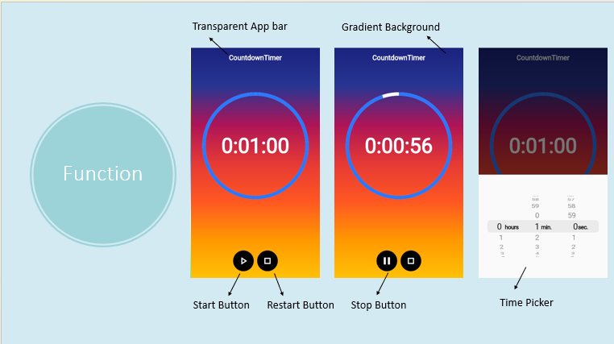

# flutter_final2

A new Flutter project.

## Getting Started

This project is a starting point for a Flutter application.

A few resources to get you started if this is your first Flutter project:

- [Lab: Write your first Flutter app](https://flutter.dev/docs/get-started/codelab)
- [Cookbook: Useful Flutter samples](https://flutter.dev/docs/cookbook)

For help getting started with Flutter, view our
[online documentation](https://flutter.dev/docs), which offers tutorials,
samples, guidance on mobile development, and a full API reference.

# Project name: POMODORA TIMER
## Motivation:Want to design a good looking timer

## Reference
- [Countdown timer](https://www.youtube.com/watch?v=bjAsnIw3VCs)
Creating a Countdown Timer using Animation in Flutter | by Ashish Rawat | FlutterDevs
- [Time picker] (https://www.youtube.com/watch?v=gQFRwAvShJc)
- [Background] (https://www.youtube.com/watch?v=eN62zlmjAEQ&t=0s)
